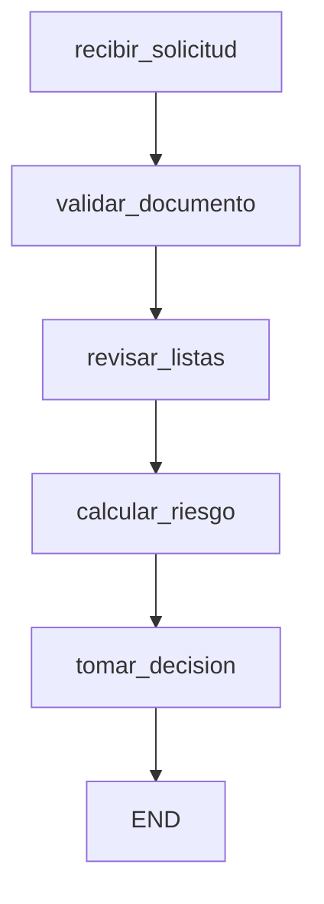

# ModelosExcelencia — Uso de Fork en LangGraph

Implementación de un flujo de **aprobación de tarjetas de crédito** usando [LangGraph](https://langchain-ai.github.io/langgraph/), con énfasis en el uso de **checkpoints** y **fork** para corregir errores en datos de entrada y re-ejecutar el flujo sin perder trazabilidad.

---

## Caso de negocio

Un cliente solicita una tarjeta de crédito mediante un canal digital. El sistema debe:

1. Recibir los datos de la solicitud.
2. Validar identidad y documentos (DNI / Carnet de extranjería).
3. Consultar listas de riesgo/fraude.
4. Calcular el score crediticio.
5. Evaluar la capacidad de pago.
6. Decidir si la solicitud se **aprueba**, pasa a **revisión manual** o se **rechaza**.

Adicionalmente, el flujo permite **forks**: si se detecta un error en la información (por ejemplo, una lectura OCR errónea de los ingresos), es posible corregir el estado y volver a ejecutar las decisiones aguas abajo conservando el historial completo de eventos.

---

## Arquitectura del flujo



### Nodos del grafo

| Nodo | Responsabilidad |
|------|-----------------|
| `recibir_solicitud` | Registra la solicitud y agrega el primer evento de trazabilidad. |
| `validar_documento` | Valida si el documento es DNI (8 dígitos numéricos) o Carnet de Extranjería (9–12 caracteres alfanuméricos). |
| `revisar_listas` | Consulta simulada de listas de riesgo/fraude basada en el documento. |
| `calcular_riesgo` | Calcula la capacidad de pago y asigna un score crediticio. |
| `tomar_decision` | Aplica reglas de negocio para devolver `APROBADO`, `REVISION_MANUAL` o `RECHAZADO`. |

---

## Estado del sistema

El estado se modela mediante un `TypedDict`:

```python
class CreditCardState(TypedDict):
    solicitud_id: str
    cliente_nombre: str
    tipo_documento: str
    dni: str
    ingresos: float
    deuda_total: float
    score_crediticio: int
    resultado_listas: str
    capacidad_pago: float
    decision: str
    eventos: List[str]
```

El campo `eventos` actúa como **bitácora de auditoría** del flujo.

---

## Reglas de negocio

### Score crediticio (según capacidad de pago)

| Capacidad de pago | Score asignado |
|-------------------|----------------|
| ≥ 3000            | 85             |
| ≥ 1500            | 65             |
| < 1500            | 40             |

### Decisión final

| Condición                              | Resultado          |
|----------------------------------------|--------------------|
| Resultado en listas = `ALTO_RIESGO`    | `RECHAZADO`        |
| Score ≥ 80                             | `APROBADO`         |
| Score ≥ 60                             | `REVISION_MANUAL`  |
| Score < 60                             | `RECHAZADO`        |

---

## Uso de Fork

El notebook ilustra cómo **corregir un estado erróneo y re-ejecutar el flujo** sin perder la historia previa:

1. Se ejecuta el flujo original con `ingresos = 7500` (valor incorrecto por OCR).
2. Se inspeccionan los snapshots con `app.get_state_history(config)`.
3. Se crea un nuevo estado (`fork_state`) corrigiendo `ingresos = 10000`.
4. Se vuelve a invocar `app.invoke(fork_state, config=config)` sobre el mismo `thread_id`.
5. Se observa cómo cambia la decisión final al recalcular el riesgo con los datos corregidos.

Esto permite **trazabilidad completa** de cómo una corrección operativa modifica la decisión del modelo.

---

## Requisitos

```bash
pip install langgraph langchain langchain-openai typing_extensions pandas
```

Probado en Python 3.12 sobre Google Colab.

---

## Ejecución

Abre el notebook `Notebook_Fork.ipynb` y ejecuta las celdas en orden. Al final se genera adicionalmente una visualización del grafo (`grafo.png`).

---

## Estructura del repositorio

```
ModelosExcelencia/
├── Notebook_Fork.ipynb     # Notebook principal con el flujo y el fork
├── README.md
└── LICENSE
```

---

## Licencia

Distribuido bajo licencia MIT. Ver [LICENSE](LICENSE) para más detalles.

---

## Autor

**Eduardo Jauregui** [@Dunned](https://github.com/Dunned)
**Jesús Zelaya** — [@jesuszelayac](https://github.com/jesuszelayac)
**Andrea Coronado** - [@Bel-93](https://github.com/Bel-93)
