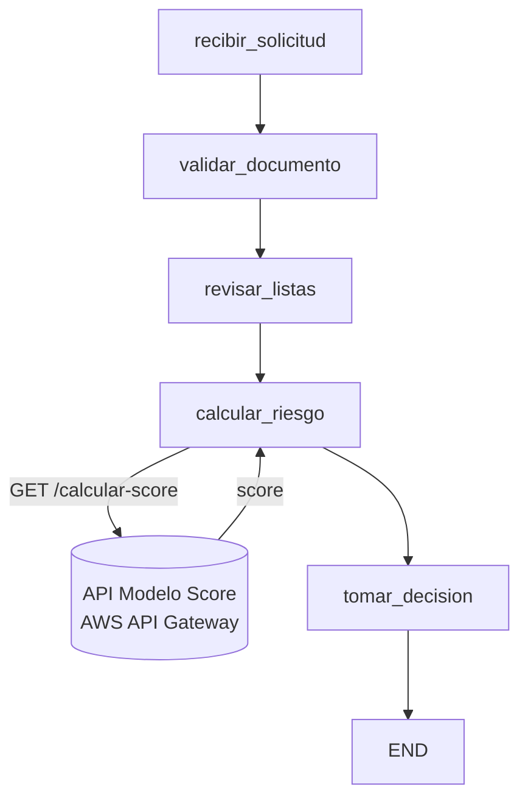

# ModelosExcelencia — Uso de Fork en LangGraph

Implementación de un flujo de **aprobación de tarjetas de crédito** usando [LangGraph](https://langchain-ai.github.io/langgraph/), con énfasis en el uso de **checkpoints** y **fork** para corregir errores en datos de entrada y re-ejecutar el flujo sin perder trazabilidad.

El cálculo del score crediticio se realiza mediante el **consumo de un API REST** que expone un modelo desplegado en AWS, separando la lógica de decisión (LangGraph) de la lógica del modelo de scoring.

[](https://colab.research.google.com/github/jesuszelayac/ModelosExcelencia/blob/main/Notebook_Fork.ipynb)

---

## Caso de negocio

Un cliente solicita una tarjeta de crédito mediante un canal digital. El sistema debe:

1. Recibir los datos de la solicitud.
2. Validar identidad y documentos (DNI / Carnet de extranjería).
3. Consultar listas de riesgo/fraude.
4. Calcular el score crediticio **consumiendo un API externo** que apunta a un modelo desplegado.
5. Evaluar la capacidad de pago.
6. Decidir si la solicitud se **aprueba**, pasa a **revisión manual** o se **rechaza**.

Adicionalmente, el flujo permite **forks**: si se detecta un error en la información (por ejemplo, una lectura OCR errónea de los ingresos), es posible corregir el estado y volver a ejecutar las decisiones aguas abajo conservando el historial completo de eventos.

---

## Arquitectura del flujo



### Nodos del grafo

| Nodo | Responsabilidad |
|------|-----------------|
| `recibir_solicitud` | Registra la solicitud y agrega el primer evento de trazabilidad. |
| `validar_documento` | Valida si el documento es DNI (8 dígitos numéricos) o Carnet de Extranjería (9–12 caracteres alfanuméricos). |
| `revisar_listas` | Consulta simulada de listas de riesgo/fraude basada en el documento. |
| `calcular_riesgo` | Calcula la capacidad de pago y **consume el API del modelo de scoring** enviando `ingresos` y `deuda_total` como parámetros. |
| `tomar_decision` | Aplica reglas de negocio sobre el score devuelto por el API para decidir `APROBADO`, `REVISION_MANUAL` o `RECHAZADO`. |

---

## Integración con el API de Scoring

El nodo `calcular_riesgo` ya **no aplica reglas locales** para asignar el score. En su lugar, realiza una llamada HTTP a un endpoint desplegado en **AWS API Gateway**:

**Endpoint:**
```
GET https://xxxxxxxx.execute-api.us-east-2.amazonaws.com/calcular-score
```

**Parámetros (query string):**

| Parámetro      | Tipo    | Descripción                          |
|----------------|---------|--------------------------------------|
| `ingresos`     | float   | Ingresos mensuales del solicitante.  |
| `deuda_total`  | float   | Deuda total vigente del solicitante. |

**Respuesta esperada:**
```json
{
  "score": 85
}
```

**Snippet del consumo dentro del nodo:**
```python
url = "https://xxxxxxxx.execute-api.us-east-2.amazonaws.com/calcular-score"

variables_prueba = {
    "ingresos": ingresos,
    "deuda_total": deuda
}

respuesta = requests.get(url, params=variables_prueba)

if respuesta.status_code == 200:
    data = respuesta.json()
    score_final = data.get("score")
```

Esta separación permite que el modelo de scoring se actualice, re-entrene o sustituya **sin necesidad de modificar el grafo de LangGraph**, manteniendo el desacoplamiento entre la **orquestación** (LangGraph) y la **inferencia** (modelo desplegado).

---

## Estado del sistema

El estado se modela mediante un `TypedDict`:

```python
class CreditCardState(TypedDict):
    solicitud_id: str
    cliente_nombre: str
    tipo_documento: str
    dni: str
    ingresos: float
    deuda_total: float
    score_crediticio: int
    resultado_listas: str
    capacidad_pago: float
    decision: str
    eventos: List[str]
```

El campo `eventos` actúa como **bitácora de auditoría** del flujo.

---

## Reglas de negocio (nodo `tomar_decision`)

| Condición                              | Resultado          |
|----------------------------------------|--------------------|
| Resultado en listas = `ALTO_RIESGO`    | `RECHAZADO`        |
| Score (API) ≥ 80                       | `APROBADO`         |
| Score (API) ≥ 60                       | `REVISION_MANUAL`  |
| Score (API) < 60                       | `RECHAZADO`        |

> La asignación del score deja de ser determinada por reglas locales y pasa a depender del modelo expuesto en el API.

---

## Uso de Fork

El notebook ilustra cómo **corregir un estado erróneo y re-ejecutar el flujo** sin perder la historia previa:

1. Se ejecuta el flujo original con un valor incorrecto de `ingresos` (simulando un error de OCR).
2. Se inspeccionan los snapshots con `app.get_state_history(config)`.
3. Se crea un nuevo estado (`fork_state`) corrigiendo el valor de `ingresos`.
4. Se vuelve a invocar `app.invoke(fork_state, config=config)` sobre el mismo `thread_id`.
5. El nodo `calcular_riesgo` **vuelve a consumir el API** con los datos corregidos y devuelve un nuevo score.
6. Se observa cómo cambia la decisión final al recalcular el riesgo con los datos corregidos.

Esto permite **trazabilidad completa** de cómo una corrección operativa modifica la decisión del modelo, dejando registro tanto del estado original como del estado corregido.

---

## Requisitos

```bash
pip install langgraph langchain langchain-openai typing_extensions pandas requests
```

Probado en Python 3.12 sobre Google Colab.

> **Nota:** El notebook requiere conexión a internet para consumir el endpoint del API de scoring desplegado en AWS.

---

## Ejecución

1. Abre el notebook `Notebook_Fork.ipynb` (recomendado: usar el badge **Open in Colab** arriba).
2. Ejecuta las celdas en orden.
3. Observa la salida del flujo original, los snapshots intermedios y el resultado del fork.
4. Al final se genera adicionalmente una visualización del grafo (`grafo.png`).

---

## Estructura del repositorio

```
ModelosExcelencia/
├── Notebook_Fork.ipynb     # Notebook principal con el flujo, el API y el fork
├── README.md
└── LICENSE
```

---

## Licencia

Distribuido bajo licencia MIT. Ver [LICENSE](LICENSE) para más detalles.

---

## Autores

- **Eduardo Jauregui** — [@Dunned](https://github.com/Dunned)
- **Jesús Zelaya** — [@jesuszelayac](https://github.com/jesuszelayac)
- **Andrea Coronado** — [@Bel-93](https://github.com/Bel-93)
